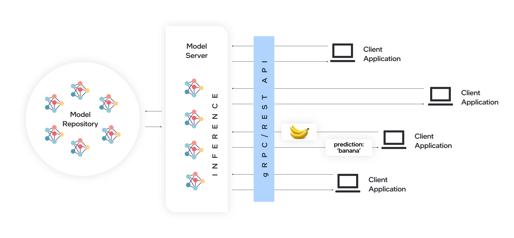
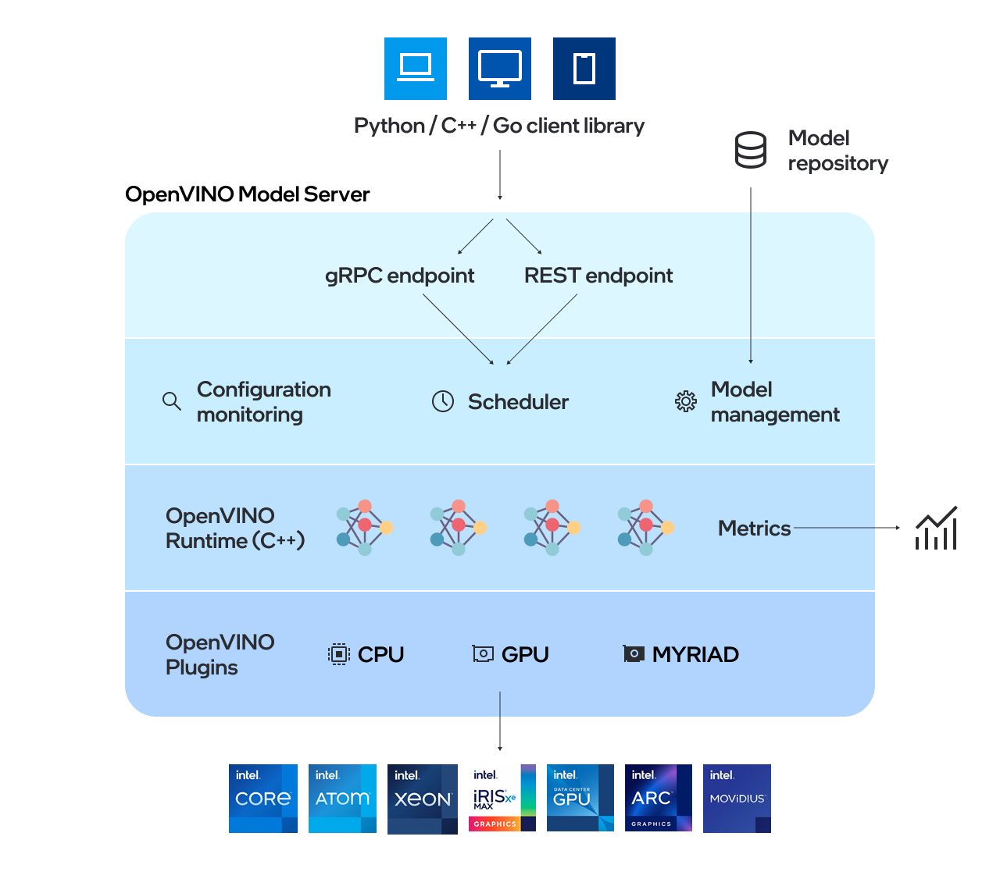

# Model Serving {#ovms_what_is_openvino_model_server}

@sphinxdirective

.. toctree::
   :maxdepth: 1
   :hidden:

   ovms_docs_quick_start_guide
   ovms_docs_starting_server
   ovms_docs_features
   ovms_docs_server_app
   ovms_docs_performance_tuning
   ovms_docs_demos
   ovms_docs_troubleshooting

@endsphinxdirective

## What Is Model Serving

Model server hosts models and makes them accessible to software components over standard network protocols: a client sends a request to the model server, which performs model inference and sends a response back to the client. Model server offers many advantages for efficient model deployment: 

- Remote inference enables using lightweight clients with only the necessary functions to perform API calls to edge or cloud deployments.
- Applications are independent of the model framework, hardware device, and infrastructure.
- Any programming language that supports REST or gRPC calls can be used to integrate with an application
- Clients require less updates since client libraries change very rarely.
- Model topology and weights are not exposed directly to client applications, making it easier to control access to the model.
- Ideal architecture for microservices-based applications and deployments in cloud environments – including Kubernetes and OpenShift clusters.
- Efficient resource utilization with horizontal and vertical inference scaling.

## Serving with OpenVINO Model Server

OpenVINO&trade; Model Server (OVMS) is a high-performance system for serving models. Implemented in C++ for scalability and optimized for deployment on Intel architectures, the model server uses the same architecture and API as [TensorFlow Serving](https://github.com/tensorflow/serving) and [KServe](https://github.com/kserve/kserve) while applying OpenVINO for inference execution. Inference service is provided via gRPC or REST API, making deploying new algorithms and AI experiments easy.

Start using OpenVINO Model Server with a fast-forward serving example from the [Quickstart guide](ovms_quickstart.md).

### Model Server Features 

- Support for AI accelerators, such as 
[Intel Movidius Myriad VPUs](https://docs.openvino.ai/2022.2/openvino_docs_OV_UG_supported_plugins_MYRIAD.html), 
[GPU](https://docs.openvino.ai/2022.2/openvino_docs_OV_UG_supported_plugins_GPU.html), and 
[HDDL](https://docs.openvino.ai/2022.2/openvino_docs_OV_UG_supported_plugins_HDDL.html) 
- [Model reshaping](shape_batch_size_and_layout.md) in runtime for high-throughput and low-latency
- [Serving pipelines of models](dag_scheduler.md) - connecting multiple models to deploy complex processing solutions and reducing data transfer overhead using Directed Acyclic Graph Scheduler
- [Creating custom nodes in DAG pipelines](custom_node_development.md) - allowing model inference and data transformations to be implemented with a custom node C/C++ dynamic library
- [Sending input data in binary format](binary_input.md) - data can be sent in JPEG or PNG formats to reduce traffic and offload the client applications
- [Serving stateful models](stateful_models.md) - models that operate on sequences of data and maintain their state between inference requests
- [Serving multiple versions of models](model_version_policy.md) 
- [Updates of models in runtime](online_config_changes.md) 
- [Performance tuning](performance_tuning.md)
- [Model caching](model_cache.md) - cache the models on first load and re-use models from cache on subsequent loads
- [Metrics usage](metrics.md) - metrics compatible with Prometheus standard

The models used by the server need to be stored locally or hosted remotely by object storage services. For more details, refer to [Preparing Model Repository](./models_repository.md) documentation. Model server works inside [Docker containers](docker_container.md), on Bare Metal, and in [Kubernetes environment](../deploy/README.md).

## Next Steps

- [Start the model server](docker_container.md)
- Follow an example from the [Quickstart guide](ovms_quickstart.md) 
- Explore the model server [features](features.md)
- Experiment with [demos](../demos/README.md)  

## Additional Resources

* [Simplified Deployments with OpenVINO™ Model Server and TensorFlow Serving](https://community.intel.com/t5/Blogs/Tech-Innovation/Artificial-Intelligence-AI/Simplified-Deployments-with-OpenVINO-Model-Server-and-TensorFlow/post/1353218) 
* [Inference Scaling with OpenVINO™ Model Server in Kubernetes and OpenShift Clusters](https://www.intel.com/content/www/us/en/developer/articles/technical/deploy-openvino-in-openshift-and-kubernetes.html) 
* [Benchmarking results](https://docs.openvino.ai/2022.1/openvino_docs_performance_benchmarks_ovms.html) 
* [Speed and Scale AI Inference Operations Across Multiple Architectures Demo Recording](https://techdecoded.intel.io/essentials/speed-and-scale-ai-inference-operations-across-multiple-architectures/?elq_cid=3646480_ts1607680426276&erpm_id=6470692_ts1607680426276) 
* [Release Notes](https://github.com/openvinotoolkit/model_server/releases) 

## Contributing

As an open source project, we welcome community contributions to OpenVINO&trade; Model Server. If you have a question, a feature request, or a bug report, feel free to submit a [Github issue](https://github.com/openvinotoolkit/model_server) in the repository.